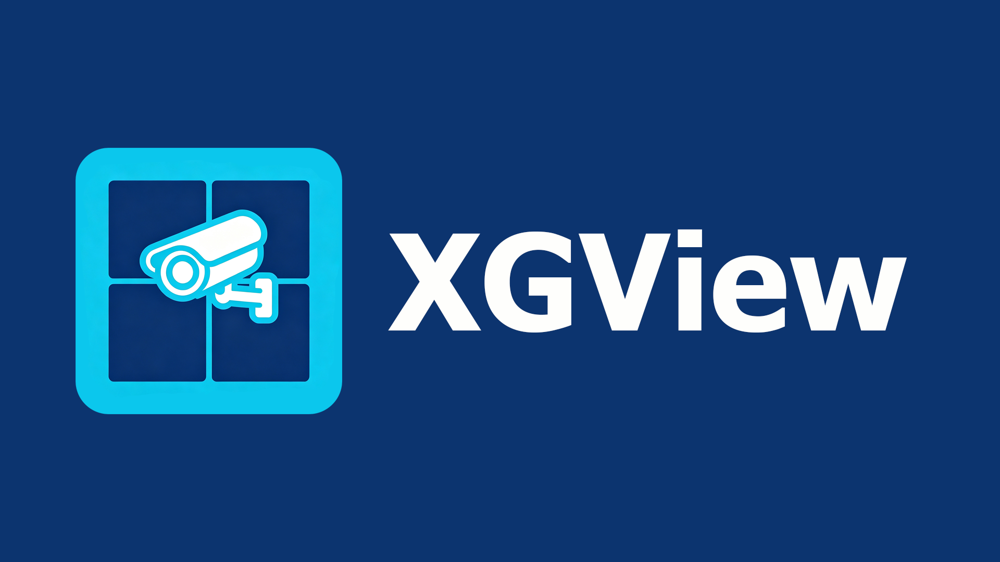
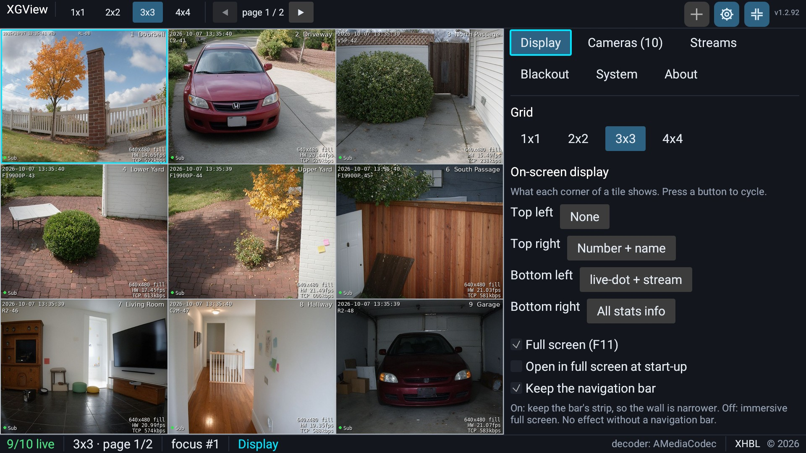
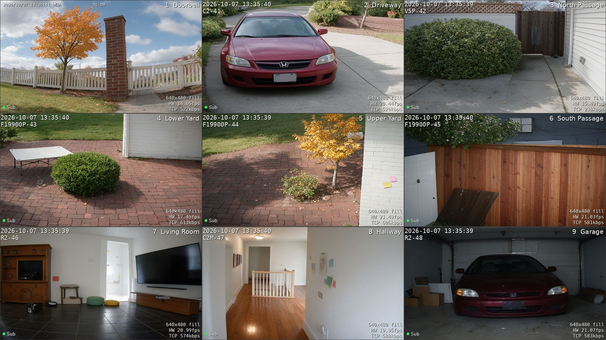

# XGView - A grid viewer for surveillance cameras

XGView is a production-grade, cross-platform surveillance wall written in Rust.
It turns a single screen into a live grid of your IP cameras - from 1x1 up to
4x4, with paging beyond that - and is built to run unattended around the clock.

It targets:

- **TV boxes and living-room displays** (Android TV, e.g. an Amlogic S905X5M or
  an Nvidia Shield TV), driven with the remote;
- **mini PCs**, on Windows or Linux, running as kiosk / control-room machines;
- **Android phones and tablets** used as a desk or pocket monitoring screen;
- **desktop Windows and Linux**, for setup and everyday use.

The same build answers to a keyboard and mouse, a living-room remote and a touch
screen alike, so one binary fits a wall-mounted box, a desktop and a tablet in
the hand.

| UI interaction | Full screen grid |
| --- | --- |
|  |  |

---

## Table of contents

- [Why XGView](#why-xgview)
- [Features](#features)
- [Supported platforms](#supported-platforms)
- [Getting started](#getting-started)
- [Usage](#usage)
  - [The wall at a glance](#the-wall-at-a-glance)
  - [Grid layouts and paging](#grid-layouts-and-paging)
  - [Zooming a camera](#zooming-a-camera)
  - [Keyboard and remote control](#keyboard-and-remote-control)
    - [Remote control (DPAD)](#remote-control-dpad)
    - [Touch screen](#touch-screen)
  - [Settings panel](#settings-panel)
  - [Adding cameras](#adding-cameras)
  - [Blackout schedule](#blackout-schedule)
  - [Keep awake](#keep-awake)
  - [Start on boot](#start-on-boot)
  - [Language](#language)
  - [Command line](#command-line)
  - [Troubleshooting](#troubleshooting)
- [License](#license)
- [Contact](#contact)

---

## Why XGView

- **Runs unattended.** Cameras reconnect on their own with configurable backoff,
  the machine can be held awake, and the wall can start at boot - a box in a
  closet keeps showing pictures for weeks without anyone touching it.
- **Cheap on bandwidth and CPU.** The grid pulls each camera's cheap sub stream;
  only a magnified camera switches to the main stream; channels on a page you are
  not looking at are suspended, sockets and decoders alike.
- **Remote-first and touch-first.** Everything from navigation to the settings
  panel is reachable with five DPAD keys, a finger or a mouse - no keyboard
  required.
- **Direct, no cloud.** XGView talks to your cameras over ONVIF and RTSP itself.
  No account, no subscription, no vendor service in the middle; the whole setup
  is one `config.json` you can copy between machines.
- **Self-contained.** A single binary with its decoder and language packs shipped
  alongside it, on Windows, Linux and Android.

## Features

| Area | What it does |
| --- | --- |
| Grid layouts | 1x1, 2x2, 3x3 and 4x4, switchable at runtime with the `1`-`4` keys or the toolbar |
| Pagination | Channels beyond the grid's capacity are paged; swipe, `PageUp` / `PageDown` or the toolbar slides between pages |
| Focus navigation | A 2 px cyan focus ring walks the tiles with the arrow keys or a TV remote's DPAD; the sideways arrows turn the page at the left and right edges, and the vertical ones stop at the top and bottom, where the wall hands the keys to the bars |
| Temporary zoom | Double click, `DPAD_CENTER`, `Enter` or `Space` magnifies a viewport to 1x1; `Esc` / `BACK` restores the grid |
| Stream switching | Every layout pulls the cheap sub stream (360P / 480P), the 1x1 grid included; only a magnified viewport switches to the main stream (1080P / 4K) |
| Seamless transition | The last sub-stream frame is held until the main stream delivers its first keyframe - no black or green frames |
| Suspend | Channels on a non-visible page are suspended to save bandwidth, CPU and decoder handles |
| Reconnection | Exponential-backoff self-healing with a non-blocking "reconnecting…" overlay; the backoff shape and the handshake timeout are configurable and reach channels already running |
| Decoding | H.264 on the GPU where the machine offers a decoder (Direct3D 11 Video / CUDA on Windows, VAAPI / CUDA on Linux, `AMediaCodec` on Android) and on the CPU elsewhere; MJPEG on the CPU everywhere. Each tile shows `HW` or `SW` |
| Codecs | H.264 and MJPEG are decoded and displayed. HEVC is recognised in the stream description but has no decoder yet, so an HEVC-only camera shows no picture |
| Transports | RTSP over TCP (interleaved, the default) or UDP, chosen per camera; HTTP / HTTPS MJPEG (`multipart/x-mixed-replace`) cameras are supported too |
| On-screen display | Each tile corner independently shows one of: none, name, number + name, stream, transport + rate, frame rate + decoder, size + shape, or all statistics |
| Power management | Keeps the machine awake and/or the screen on while the wall is up (`SetThreadExecutionState` on Windows, `caffeinate` on macOS, `systemd-inhibit` on Linux, `WakeLock` + `FLAG_KEEP_SCREEN_ON` on Android); both switches default on |
| Blackout | Scheduled periods, per weekday, in which the wall blanks itself and parks every channel - sockets closed, decoders dropped; input brings it back for a chosen number of minutes |
| Language | English, Chinese, or any language added as an external `.ftl` pack; a partial pack falls back to English key by key |
| Toolbar | An on-screen bar for the layout, paging, full screen, settings and adding cameras; usable with a mouse, touch or a remote |
| Discovery | ONVIF WS-Discovery multicast probe, cross-subnet unicast scan, and a TCP 554/80/8000 fallback probe, followed by `GetProfiles` / `GetStreamUri` |
| NVR | Synology Surveillance Station import via `SYNO.API.Auth` + `SYNO.SurveillanceStation.Camera` |
| Cameras | Add, edit, reorder and remove cameras; per-camera display aspect and RTSP transport (UDP when a relay damages the TCP interleaving) |
| Start on boot | Windows `HKCU\...\Run` registry entry (or a scheduled task) and an Android `BOOT_COMPLETED` receiver |
| Configuration | Everything persisted to a cross-platform `config.json`, with export / import |

## Supported platforms

| Platform | Typical device | Decoding |
| --- | --- | --- |
| **Android** (arm64-v8a, armeabi-v7a) | TV box, phone, tablet | `AMediaCodec` - hardware |
| **Windows** x64 | mini PC, kiosk, desktop | Direct3D 11 Video or CUDA - hardware, with a CPU fallback |
| **Linux** x64 | desktop, mini PC | VAAPI or CUDA - hardware, with a CPU fallback |

Hardware decoding covers H.264; MJPEG is always decoded on the CPU. It needs a
GPU that offers VAAPI or CUDA, which a desktop with an NVIDIA, Intel or AMD
graphics does; a machine that offers neither decodes on the CPU, where the wall
still runs - comfortable for a grid of sub streams, and heavier once it starts
pulling main streams. A tile whose corner is set to the frame-rate item shows
`HW` or `SW`, so you can see at a glance which path a camera is on.

---

## Getting started

XGView is a GUI: start `xgview` (or double-click `xgview.exe`) and the wall comes
up with whatever cameras are already in its configuration.

1. **Get the build.** Windows ships as a zip you unpack anywhere; Android ships
   as a signed APK; or build from source. See [docs/CONFIG.md](docs/CONFIG.md).
2. **Add cameras.** On the first run the grid is empty - press `F2` to discover
   cameras on the network, or add one by hand.
3. **Make it yours.** Press `F1` for the settings panel: layout, OSD, language,
   reconnect timings, the blackout schedule and start on boot.

Nothing is installed and nothing is registered behind your back; the Windows
package is a directory you can delete to uninstall.

### Where the settings live

Everything is stored in one `config.json`:

| Platform | Path |
| --- | --- |
| Windows | `%APPDATA%\xgview\config.json` |
| Linux (and macOS) | `$XDG_CONFIG_HOME/xgview/config.json`, else `~/.config/xgview/config.json` |
| Android | the app's private data folder |
| Any | set `XGVIEW_CONFIG_DIR` to override the folder, or pass `--config <PATH>` |

The **About** tab exports and imports the file (on Android, export writes to
`Download/xgview/config.json` and import opens the system file picker). Importing
replaces the whole configuration; a checkbox imports only the cameras and keeps
your viewer settings.

---

## Usage

### The wall at a glance

The wall fills the window with a grid of tiles, one per camera. Two thin bars
frame it:

- the **toolbar** along the top carries the layout buttons, the page arrows, full
  screen, settings and *add devices*;
- the **status bar** along the bottom shows how many channels are live, the
  layout and page, the zoom state, the focused channel and the decoder in use.

Each tile can show a status of its own in a corner: `waiting for video`,
`Switching to main…` while it hands over streams, `holding last sub frame` when a
camera stalls, `suspended` when it is on another page, or `Stream failed` with the
reason when a connection cannot be established. The bars fade out while you watch
and come back as soon as you move a mouse, a finger or the remote.

### Grid layouts and paging

Pick a layout with the `1`, `2`, `3` or `4` key, or with the toolbar buttons:
**1x1**, **2x2** (the default), **3x3** and **4x4**. When there are more cameras
than the grid can hold, the extra ones go onto further pages; move between pages
with `PageUp` / `PageDown`, the toolbar arrows, or a horizontal swipe. Channels on
the pages you are not looking at are suspended, so a wall of sixteen cameras does
not open sixteen decoders to show four.

### Zooming a camera

Magnify the focused tile to fill the screen with a double click (or a double tap
on a touch screen), `Enter`, `Space` or `DPAD_CENTER`. The magnified camera
switches from its sub stream to its main stream, while the last sub-stream frame
stays on screen until the main picture arrives - so the transition shows no black
or green frames. `Esc` / `BACK`, or another double click, returns to the grid.

### Keyboard and remote control

| Key | Action |
| --- | --- |
| Arrow keys / DPAD | Move the focus between viewports (turns the page at the edges) |
| `Enter` / `Space` / `DPAD_CENTER` | Magnify the focused viewport to 1x1, press again to return |
| `Esc` / `Backspace` / `BACK` | Leave the magnified view |
| `PageUp` / `PageDown` | Previous / next page |
| `1` `2` `3` `4` | Select the 1x1 / 2x2 / 3x3 / 4x4 layout |
| `F1` | Settings panel |
| `F2` | Camera discovery / management window |
| `F11` | Toggle full screen |

`BACK` is layered: it first leaves a magnified view, then closes a window, then
closes the settings panel, then brings the bar back - and only a second press on
an otherwise idle wall asks whether to quit, so one accidental press never drops
the wall.

Mouse and touch dragging horizontally over the grid also turns the page. The
toolbar across the top offers the same layout, paging, full screen, settings and
add-camera actions as buttons, for a device without a keyboard.

#### Remote control (DPAD)

XGView is designed to be driven with nothing but a TV remote. Every action is
reachable through the five DPAD keys - up, down, left, right and center - plus
`BACK`, so no on-screen keyboard or keyboard-only shortcut is ever required:

- **Clear focus, always visible.** The focused viewport is marked by a 2 px cyan
  focus ring, and the focus is restored to a sensible tile after every layout
  change, page turn or zoom, so the user never loses track of where the remote
  points.
- **Edges do the obvious thing.** The sideways arrows turn the page when the
  focus is at the left or right edge of the grid; the vertical arrows stop at the
  top and bottom and hand the keys to the toolbar, letting the DPAD reach the
  toolbar without a mouse.
- **No dead keys.** The horizontal and vertical arrows together with `BACK`
  cover navigation, magnifying a viewport (`DPAD_CENTER`) and leaving it
  (`BACK`), so a remote with a minimal key set is enough.
- **Long press repeats.** Holding a direction keeps moving the focus at the
  remote's own auto-repeat rate, which makes long grids and menus quick to cross.
- **Menus follow the same model.** The settings panel and the camera and
  discovery windows are plain focus lists: arrows move, `DPAD_CENTER` selects
  and `BACK` closes, so the whole application - not just the wall - is remote
  friendly.

#### Touch screen

The same build runs on Android phones and tablets, where the interface is driven
entirely by the finger - useful when a tablet is left on a desk or carried around
as a portable monitoring screen:

- **Tap to focus, double tap to magnify.** A tap focuses a tile; a double tap
  magnifies it to 1x1, and a second double tap returns it to the grid - the touch
  equivalent of `DPAD_CENTER`, with no `BACK` needed.
- **Swipe to page.** Dragging horizontally over the grid turns the page, with the
  outgoing page sliding under the finger; while magnified the same swipe steps to
  the next or previous channel.
- **Finger sized targets.** The toolbar buttons, the settings panel and the
  windows are laid out as touch targets rather than as glyphs, so they are hit
  easily on a phone held in landscape.
- **Soft keyboard where text is needed.** Tapping a text field on Android raises
  the on-screen keyboard; every other action needs no typing.

### Settings panel

`F1` opens a tabbed panel, navigable with the arrows and `Enter` on a remote:

| Tab | What it holds |
| --- | --- |
| Display | Interface **language**, grid, the four OSD corners, full screen at start-up, the Android navigation bar |
| Cameras | The camera list: add, edit, reorder, remove; display aspect and RTSP transport per camera (the "Confirm order" step) |
| Streams | Reconnect timings (first retry, first-frame retry, max delay, handshake timeout, backoff factor / jitter / spread, attempts) and the hardware-decoding preference |
| Blackout | The blank schedule: on/off, the periods (weekday, start, end), and how long the wall stays back after input |
| System | Start on boot, **keep awake** (prevent sleep / keep the screen on) with the mechanism in use, the key list, and the Android boot helpers |
| About | Version, author, decoder in use, config path, export / import |

Every change is written to `config.json` as you make it, so there is no separate
"save" step.

### Adding cameras

Press `F2` to open the *add devices* window, which has three pages:

1. **ONVIF / network scan** - broadcasts a WS-Discovery probe to
   `239.255.255.250:3702`, optionally scans one or more IP ranges with unicast
   probes for cameras that do not answer on the local subnet, and falls back to a
   TCP scan of ports 554/80/8000 for cameras that stay silent. The ranges accept
   `192.168.1.1-254`, `192.168.1.10-192.168.1.60` or CIDR `10.0.0.0/24`. Once a
   device answers, `GetProfiles` / `GetStreamUri` pull its main and sub stream
   RTSP URLs; credentials for protected cameras go in the *ONVIF credentials*
   fields.
2. **Manual entry** - paste a main stream RTSP URL and let the built-in rules
   derive the sub stream, or fill both in by hand. The rules know the usual
   Hikvision, Dahua, Foscam, Axis and generic `/stream1` → `/stream2` and
   `/main` → `/sub` conventions; an HTTP or HTTPS MJPEG URL works here too.
3. **Synology NAS** - sign in to a Surveillance Station host and import every
   camera bound to the NAS in one go, main stream and sub stream both.

Cameras are listed in the **Cameras** tab, where they can be renamed, reordered,
disabled, and given a display aspect (original, stretch, 16:9, 4:3 or 1:1) and a
transport per camera.

### Blackout schedule

The **Blackout** tab blanks the wall during the periods you choose - useful when
a screen in a room should stop glowing at night. A period has a set of weekdays
and a start / end time; an end earlier than the start crosses midnight (an equal
start and end means the whole day), and a new period begins as the template
*every day, 22:00 to 07:00*. Blackout is not sleep: the process and the window
stay up, but every camera socket is closed and every decoder dropped, so the
machine goes quiet. Any input - a key, the remote, a touch - brings the wall back
for the number of minutes you set (a value of `0` keeps it awake for the rest of
the period).

### Keep awake

The **System** tab can hold the machine awake and keep the screen on while the
wall is up, so a display that would blank or a system that would sleep does not
cut the streams. Both switches are on by default; keeping the screen on also
keeps the system awake. The mechanism per platform is `SetThreadExecutionState`
(Windows), `caffeinate` (macOS), `systemd-inhibit` (Linux) and `WakeLock` +
`FLAG_KEEP_SCREEN_ON` (Android), and is shown in the panel. The request is
released when the viewer exits; see
[docs/power-management-plan.md](docs/power-management-plan.md).

### Start on boot

**Windows.** Toggle "Start with the system" in the settings panel (`F1`), or run

```powershell
xgview.exe --install-autostart
```

which writes `HKCU\Software\Microsoft\Windows\CurrentVersion\Run`. Remove it with
`xgview.exe --remove-autostart`. For a machine that must start without an
interactive logon, install a scheduled task instead (see
[docs/CONFIG.md](docs/CONFIG.md)) or register the binary as a Windows service.

**Android.** The manifest registers a `BootReceiver` for `BOOT_COMPLETED`, which
relaunches the activity after the box booted. Android 10+ refuses to start an
activity from the background, and that broadcast is one, so the relaunch is
aborted - silently, from the viewer's side - unless the app is whitelisted.
Either of these, a one-time step on each device, is enough:

* **Start over other apps** - grant the *Display over other apps* special
  permission (`SYSTEM_ALERT_WINDOW`, declared in the manifest). The settings
  panel's **System** tab has a button that opens the screen, and shows whether
  it is granted.
* **Home app** - the manifest also offers XGView as a home app; the **System**
  tab has a button that opens the chooser. No permission is involved, at the
  cost of replacing the box's own launcher.

From a computer, the first is one command:

```bash
adb shell appops set com.xhbl.xgview SYSTEM_ALERT_WINDOW allow
```

### Language

The interface is English by default; Chinese ships as `langs/zh-CN.ftl`. Any
other language is a plain `.ftl` file: put it beside the executable (`langs/`) or
under the configuration directory (`langs/`) and it appears in the **Language**
selector in the Display tab. A pack may translate only part of the interface -
anything it leaves out falls back to English. `Automatic` follows the system
locale.

### Command line

```
xgview [OPTIONS]

  --config <PATH>      Use an explicit configuration file
  --fullscreen         Start in full screen (TV / kiosk deployment)
  --windowed           Start in a window even if the configuration asks for full screen
  --autostart          Marker used by the start-on-boot registration
  --install-autostart  Register XGView for start-on-boot and exit
  --remove-autostart   Remove the start-on-boot registration and exit
  --print-schedule     Print the resolved grid / channel schedule and exit
  --console            Open a console window for log output (Windows only)
  -h, --help           Print this help
  -V, --version        Print the version
```

`--print-schedule` is useful to validate a configuration on a headless box: it
lists every page of every layout and shows which camera is decoded on which
stream. On Windows the console window is released automatically when the GUI
starts; `--console` keeps it for log output.

### Troubleshooting

- **A tile shows `Stream failed` with a reason.** The camera could not be
  reached or would not start a session. Check the URL and credentials in the
  **Cameras** tab, make sure the host is reachable from the machine running
  XGView, and try the other transport (UDP is often what fixes a stream that a
  relay or a NAT mangles over TCP).
- **A camera stays on `waiting for video`.** The connection is up but no picture
  has arrived. Confirm the stream is H.264 or MJPEG - HEVC cameras are not
  decoded yet, so use their H.264 sub stream meanwhile.
- **The picture freezes and jumps.** A software decode of a high-resolution
  stream can fall behind the camera. Leave hardware decoding on, and prefer the
  sub stream for the grid.
- **Nothing answers the network scan.** Some cameras ignore WS-Discovery on a
  different subnet. Add the range explicitly in the scan settings, or add the
  RTSP URL by hand on the **Manual** page.
- **The APK does not come back after a reboot.** Grant the *Display over other
  apps* permission, or set XGView as the home app - see
  [Start on boot](#start-on-boot).
- **Where are the logs?** Set the `RUST_LOG` environment variable (for example
  `RUST_LOG=xgview=debug`) before starting; on Windows run with `--console` to
  see them in a console window.

---

## License
This project is licensed under the [MIT License](LICENSE). All code in this repository are free to use, modify, and distribute under the terms of this license.

---

## Contact
**E-mail**: [Send Email](mailto:newxhbl@hotmail.com?subject=[XGView]%20Inquiry)  
**Issues**: [Open Issue](../../issues)  
